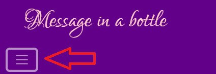
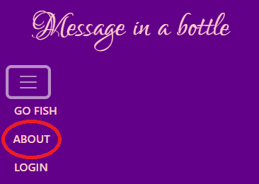
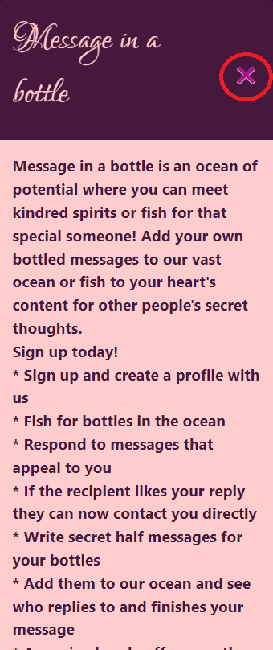
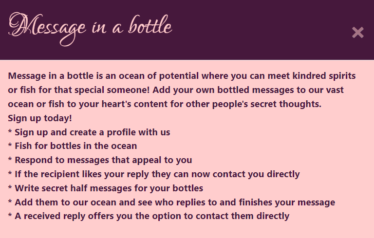
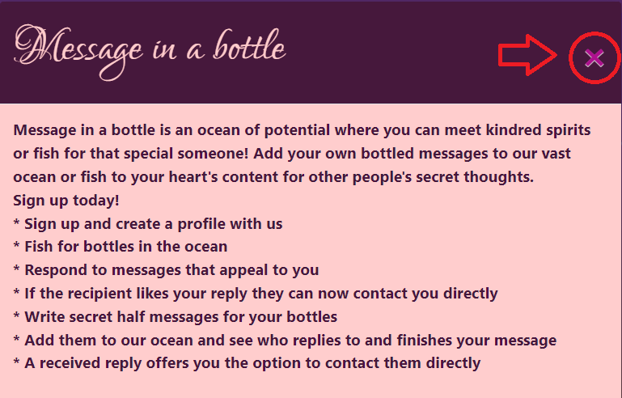

# Overview
This project is a conjunct effort of [Amir Rastkhadiv](https://github.com/Amir-Rastkhadiv), [Chris Carabine](https://github.com/ccarabine),[Cian O'Connor](https://github.com/AlexNexton), [Daniel Callaghan](https://github.com/xiaoniuniu89), [Monique Veldman](https://github.com/Seamse) and [Rodolfo Frainer](https://github.com/nellymaw).

The project aims to connect people through half phrases at a time.

# Table of contents
- [Overview](#overview)
- [Table of contents](#table-of-contents)
- [About](#about)
- [UX Design](#ux-design)
  - [User Stories](#user-stories)
  - [Typography](#typography)
  - [Colors](#colors)
  - [Wireframes](#wireframes)
- [Features](#features)
  - [Features left to impliment](#features-left-to-impliment)
- [Technologies Used](#technologies-used)
  - [Languages Used](#languages-used)
  - [Frameworks, Libraries & Programs Used](#frameworks-libraries--programs-used)
  - [Dev Tools](#dev-tools)
- [Testing](#testing)
  - [Validation Results](#validation-results)
  - [Test Cases](#test-cases)
- [Deployment](#deployment)
  - [GitHub Pages](#github-pages)
  - [Forking the GitHub Repository](#forking-the-github-repository)
  - [Making a Local Clone](#making-a-local-clone)
  - [Gitpod](#gitpod)
- [Credits](#credits)

# About
Message in a bottle is an ocean of potential where you can met kindred spirits or fish for that special someone!
Add your own bottled messages to our vast ocean or fish to your heart's content for other people's messages.
Sign up today!
- Sign up and create a profile with us
- Fish for bottles in the ocean
- Respond to messages that appeal to you
- If the recipient likes your reply they can now contact you directly
- Write secret half messages for your own bottles
- Add them to our ocean and see who replies to and finishes your message
- A received reply offers you the option to contact them directly

# UX Design

## User Stories
- As a user I would like to be able to access the about section of the page to understand it's purpose and how to interact with it.

- As a user I would like to be able to create an account.

- As a user I would like to be able to login into the account I've previously created.
  
- As a user I would like to be able to edit my Bio on my account.

- As a user I would like to be able to change my account's password.

- As a user I would like to be able to create my own bottled messages so other people can interact with.

- As a user I would like to be able to choose which bottle i want to pick.

- As a user I would like to be able to respond or not to a bottle that I have picked up.

- As a user I would like to be able to access my inbox so that i can read sent and received messages.

- As a user I would like the messages in my inbox to be refreshed periodically.

- As a user I would like to be able to read the bio and see the profile picture of a user that has replied to my bottled message so I can decide if I want to contact them or not.

- As a user I would like to be able to contact other users who have replied to my bottles via a contact form.

## Typography
- [Lato](https://fonts.google.com/specimen/Lato?query=lato&preview.text=Love%20is%20in%20the%20air&preview.text_type=custom#standard-styles) and [Lovers Quarrel](https://fonts.google.com/specimen/Lovers+Quarrel?query=love&preview.text=Love%20is%20in%20the%20air&preview.text_type=custom) fonts were used.

## Colors

 `#590c8d`

 `#FFCCCC`

 `#42193D`

 `#C31AAD`

 `#FFFFFF`


## Wireframes

Wireframes can be found [here](WIREFRAMES-MISSING)


# Features
## Features left to impliment


# Technologies Used 
## Languages Used

- [HTML](https://developer.mozilla.org/en-US/docs/Web/HTML) 
- [CSS](https://developer.mozilla.org/en-US/docs/Web/CSS) 
- [JavaScript](https://developer.mozilla.org/en-US/docs/Web/JavaScript) 
- [Jquery](https://jquery.com/) 
- [Python](https://www.python.org/) 

## Frameworks, Libraries & Programs Used

- [Django:](https://www.djangoproject.com/) Django is the framework used through the project.
- [Gitpod:](https://www.gitpod.io) 
   Gitpod was used as an IDE for most of the participants.
- [Github:](https://www.github.com)
   GitHub is used to store the projects code after being pushed from [Git](https://git-scm.com/).
- [Font Awesome:](https://fontawesome.com/)
    Font Awesome was used on all pages throughout the website to add icons for aesthetic and UX purposes.
- [Google Fonts:](https://fonts.google.com/)
    Google fonts were used to import the 'Lato' font into the style.css file which is used on all pages throughout the project.
- [Balsamiq:](https://https://balsamiq.com/)
    Balsamiq was used to create the wireframes used on this project.
- [AmIResponsive:](http://ami.responsivedesign.is/)
    Was used to check the website's responsiveness on common resolutions.

## Dev Tools
[Chrome Dev Tools](https://developer.chrome.com/docs/devtools/) & [Firefox Developer Tools](https://developer.mozilla.org/en-US/docs/Tools)

# Testing 

## Validation Results
HTML

[W3C validator](MISSING-URL)

CSS

[(Jigsaw) validator](MISSING-URL)

JSHint

[JSHint](https://jshint.com/) test completed with no error or warnings.

Lighthouse

Result for Desktop 


Result for Mobile


## Test Cases
- To access the about section of the page:
  - Low resolution devices<br><br>
    Click on the hamburger menu<br>
    

    A few options will appear, click on the about button<br>
    

    Once clicked it will open a modal window<br>
    

    To close it the user can either press the X button or click outside of the modal<br>
    


  - High resolution devices:<br><br>
    On the right corner of the nav bar you will find the About button<br>
    

    Once clicked it will open a modal window<br>
    

    To close it the user can either press the X button or click outside of the modal<br>
    

- To create an account:

- To login on a previously created account:

- To edit one's Bio on their account:

- To change an account's password:

- To create bottled messages:

- To pick a bottled message from someone:

- To respond to a picked up bottle:

- To not respond to a picked up bottle:

- To access the user's inbox:

- T check if the inbox was refreshed automatically:

- To view the profile of an user that has replied to one of the messages written by the user:

- To contact another user via the contact form provided.

# Deployment

## GitHub Pages

The project was deployed to GitHub Pages using the following steps...

1. Log in to GitHub and locate the [GitHub Repository](!!!CHANGE-THIS!!!)
2. At the top of the Repository (not top of page), locate the "Settings" Button on the menu.
3. Scroll down the Settings page until you locate the "GitHub Pages" Section.
4. Under "Source", click the dropdown called "None" and select "Master Branch".
5. The page will automatically refresh.
6. Scroll back down through the page to locate the now published site [link](!!!CHANGE-THIS!!!) in the "GitHub Pages" section.

## Forking the GitHub Repository

By forking the GitHub Repository we make a copy of the original repository on our GitHub account to view and/or make changes without affecting the original repository by using the following steps...

1. Log in to GitHub and locate the [GitHub Repository](!!!CHANGE-THIS!!!)
2. At the top of the Repository (not top of page) just above the "Settings" Button on the menu, locate the "Fork" Button.
3. You should now have a copy of the original repository in your GitHub account.

## Making a Local Clone

1. Log in to GitHub and locate the [GitHub Repository](!!!CHANGE-THIS!!!)
2. Under the repository name, click "Clone or download".
3. To clone the repository using HTTPS, under "Clone with HTTPS", copy the link.
4. Open Git Bash
5. Change the current working directory to the location where you want the cloned directory to be made.
6. Type `git clone`, and then paste the URL you copied in Step 3.

```
$ git clone https://github.com/YOUR-USERNAME/YOUR-REPOSITORY
```

7. Press Enter. Your local clone will be created.

```
$ git clone https://github.com/YOUR-USERNAME/YOUR-REPOSITORY
> Cloning into `CI-Clone`...
> remote: Counting objects: 10, done.
> remote: Compressing objects: 100% (8/8), done.
> remove: Total 10 (delta 1), reused 10 (delta 1)
> Unpacking objects: 100% (10/10), done.
```
## Gitpod

1. Install the gitpod browser extension. [Gitpod Browser Extension](https://www.gitpod.io/docs/browser-extension/)
2. Go to the project repository. [Here](!!!CHANGE-THIS!!!)
3. click the gitpod button beside the about section.  


# Credits

- [w3schools](https://www.w3schools.com/howto/howto_css_modals.asp)
- Images were taken from [Pexels.com](https://www.pexels.com)